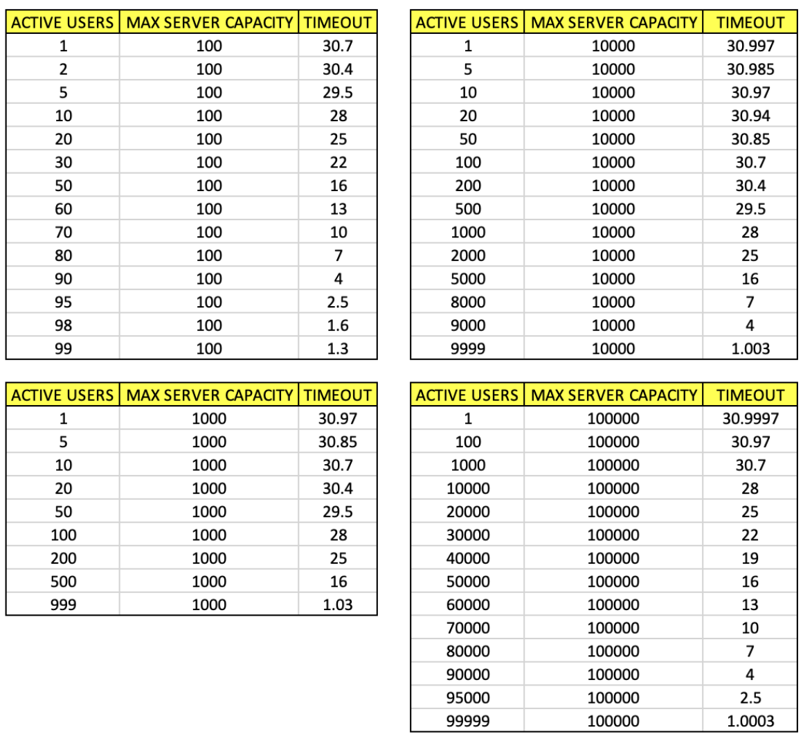

# HTTPReboot
## Rediscovering the Foundations of the Web: A Journey Through HTTP and Sockets

In the early 1990s, Tim Berners-Lee and his team at CERN laid the groundwork for the modern internet by developing the foundational technologies that power the web today. Among these groundbreaking innovations were the Hyper Text Transfer Protocol (HTTP), Hyper Text Markup Language (HTML), and the technology for both a web server and a text-based browser. This trio of technologies revolutionized information sharing, paving the way for the global, interconnected digital world we live in.

Initially, HTTP was a simpler protocol, predominantly characterized by the GET method, which allowed for requesting pages from a server. The simplicity of these early days is often overshadowed by the complex, multifaceted nature of today's web. However, there's immense value in revisiting and understanding these foundational elements. This project is an homage to that pioneering spirit, aiming to deepen our understanding of HTTP by reconstructing its core mechanics from the ground up.

## Project Goals
1. The development of a multi-threaded Web Server that handles HTTP requests using the `GET` and `POST` methods, as outliend in the HTTP/1.1 standard.
2. The development of a web client that is capable of sending `GET` and `POST` requests to a web server.
3. Implementing the HTTP/1.1 features that include <b>Persistent Connections</b>, <b>Request Pipelining</b> and <b>Connection Timeout Heuristic</b>.

## Program Design
### Using multi-threading rather than multi-processing

The web server uses multi-threading for handling multiple requests from different users. For each open socket, a thread is assigned with persistent connection.
The reasons for choosing multi-threading rather than multi-processing are:
1. Simplicity, handles blocking I/O well and utilizes multi-core processors.
2. Threads are usually cheaper than processes.
3. To start up a process, you need to duplicate all the resources of the parent process. When
it terminates, everything has to be torn down.

### Dynamic Timeout Heuristic
A mechanism to dynamically manage connection timeouts based on server load.
- If the server is idle, it allows connections to remain open for a longer period.
- If the server is busy, it shortens the time an idle connection is kept open to free up resources.

The heuristic function depends on the system specifications and requirements. Therefore, we designed a function that can dynamically assign timeout periods based on 3 factors:
- MAX_TIMEOUT (<i>Server Config</i>)
- MAX_CONNECTIONS (<i>Server Config</i>)
- ACTIVE_CONNNECTIONS (<i>Current State</i>)

Notice That:
- <b>MAX_TIMEOUT</b> and <b>MAX_CONNECTIONS</b> are constants that can be modified based on the server hardware specification and system admins requirements.

Final Heuristic Function:

<b>Timeout = MAX_TIMEOUT – (MAX_TIMEOUT / MAX_CONNECTIONS) * ACTIVE_CONNECTIONS + 1</b>



## Pseudocodes
### Web-Server Pseudocode
```
while true:
    Listen for connections
    Accept new connection from incoming client and delegate it to a worker thread/process
    Parse HTTP/1.1 request and determine the command (GET or POST)
    If GET, check if target file exists and return error if not found
    If GET, transmit file contents (read from file and write to socket)
    Wait for new requests (persistent connection)
    Close if connection times out
end while
```

### Web-Client Pseudocode
```
Create a TCP connection with the server
while more operations exist:
    Send the next request to the server
    If GET, receive data from the server
    If POST, send data to the server
end while
Close the connection
```

## Performance Evaluation
The following table shows performance results from Postman. Several virtual users is created and sends requests for 2 minutes. Avg. response time, Requests/second, total requests sent, and errors are tracked.

| Virtual Users | Total Requests | Requests/second | Avg. Response Time (ms) | Error Rate (%) |
|---------------|-----------------|------------------|--------------------------|----------------|
| 20            | 2,509           | 19.85            | 3            | 0.00           |
| 40            | 5,019           | 39.92            | 3            | 0.02           |
| 60            | 7,472           | 59.23            | 3            | 0.03           |
| 80            | 9,976           | 79.22            | 2            | 0.02           |
| 100           | 12,567          | 99.80            | 2            | 0.02           |

## Conclusion
We were able to build a web server that efficiently handles incoming requests. It follows  HTTP/1.1 specifications. It is reliable to serve for a basic website similar to those built in the 1991 by Sir Tim Berners-Lee.


## References
- Online: “Beej’s Guide to Network Programming: Using Internet Sockets”
- ‘TCP\IP Sockets in C’ book